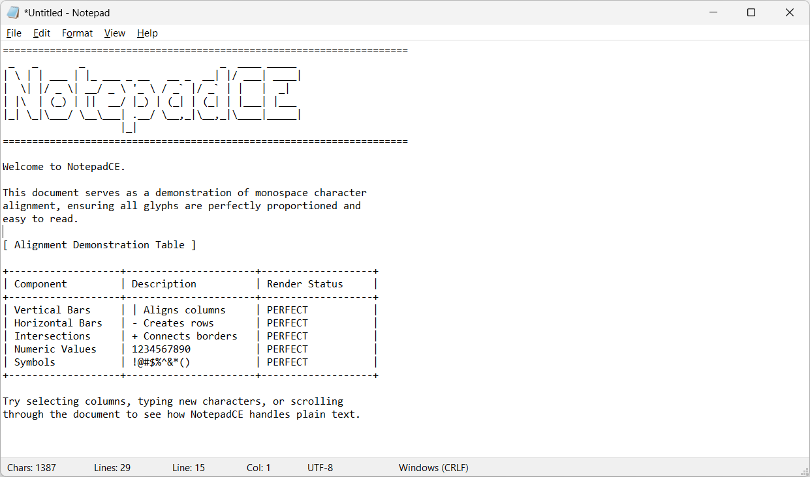
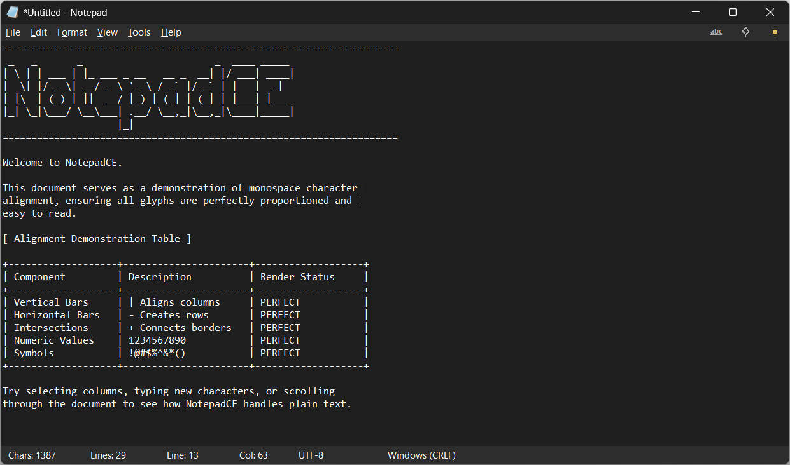
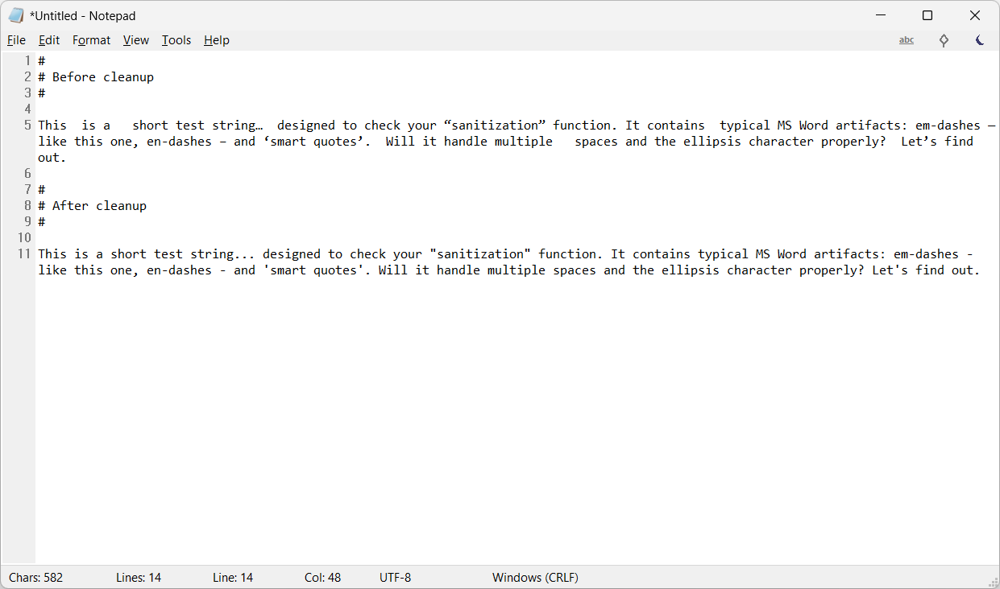
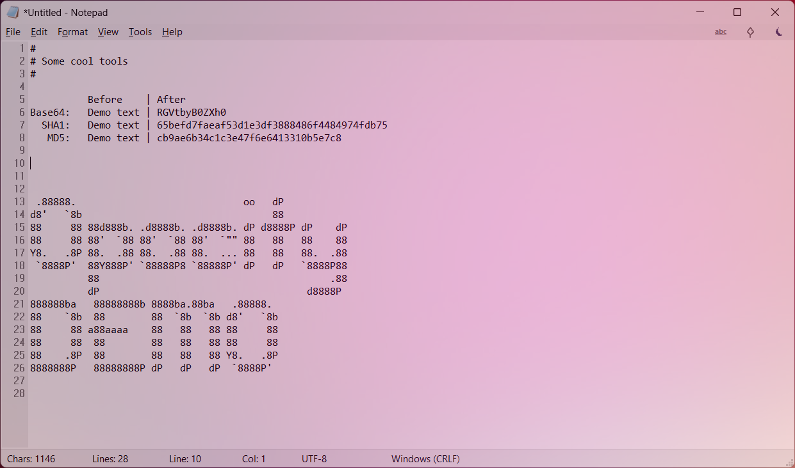

# NotepadCE

**A fast, lightweight, fully portable text editor for Windows — with the soul of the classic Notepad and the polish of a modern tool.**

NotepadCE is a fork of [Legacy Notepad](https://github.com/forloopcodes/legacy-notepad) written in pure C++ on top of the Win32 API. It is intended as a daily-driver replacement for the built-in `notepad.exe` on Windows 11 — no telemetry, no Microsoft account, no cloud, no Store, no half-second cold start. A single `.exe` file, fully portable, under half a megabyte.



---

## Table of contents

- [Features](#features)
- [Keyboard shortcuts](#keyboard-shortcuts)
- [Requirements](#requirements)
- [Antivirus false positives](#antivirus-false-positives)
- [Building from source](#building-from-source)
- [Architecture](#architecture)
- [Multi-language support](#multi-language-support)
- [License and credits](#license-and-credits)

---

## Features

### Text editing

- **Editor based on the RichEdit 5.0 (Msftedit) control** — fast, mature, native.
- **Full Unicode support**, including Polish, Japanese and other diacritic-heavy scripts.
- **Multi-step undo / redo**.
- **Standard clipboard operations** — cut, copy, paste, delete, select all.
- **Duplicate line** (`Ctrl+D`) — copies the current line and inserts it below; caret returns to the same column on the new line.
- **Delete line** (`Ctrl+E`) — removes the entire current line with a single shortcut.
- **Move line up / down** (`Alt+Up` / `Alt+Down`) — moves the current line, or every line the selection touches, keeping the selection.
- **Indent / dedent** (`Tab` / `Shift+Tab`) — shifts whole selected lines instead of replacing the selection with a tab.
- **Auto-indent** — a new line inherits the leading whitespace of the previous one.
- **Insert date and time** (`F5`) — with a configurable format.
- **Plain-text paste** — pasted content is always inserted as unformatted text in the editor's single font, exactly like the classic Notepad. Rich sources (Word / Outlook / browsers) keep their text and line breaks but drop fonts, colours and styling, so a paste never leaves a patchwork of typefaces behind.
- **Insert special character** — a quick popup of common glyphs (`€ £ © ® ™ § ° • ·`) from a menu-bar icon, inserted at the caret.
- **Line numbers** (gutter) with a small visual gap from the editor for readability.
- **Word wrap** (toggled from the Format menu).
- **Zoom** — `Ctrl++`, `Ctrl+-`, `Ctrl+0` (reset).
- **Show special characters** — visualize spaces, tabs and line endings.
- **Highlight current line** and **highlight all occurrences of the selected word** — optional, both off by default (toggled in Edit → Settings, to stay close to the classic Notepad); theme-aware translucent fills, no impact on the document itself.

### Snippets

- **Snippets side panel** — a resizable, full-height tree docked to the right edge, mirroring a real `Snippets` directory next to the executable (portable, like everything else: manage it from Explorer, back it up by copying a folder).
- **Real folders, real `.txt` files** — sub-directories become folder nodes with Explorer's folder icon, `*.txt` files become snippets with the text-document icon; other file types are ignored.
- **Double-click (or Enter) opens a snippet** for editing — `Ctrl+S` saves straight back to the snippet file.
- **Insert at caret** — the context menu pastes a snippet's content into the current document without leaving it (undoable).
- **Create / rename / delete** snippets and folders from the context menu (in-place label editing, `F2`, `Del`); deletion goes to the **Recycle Bin**, never a hard delete.
- **Drag & drop** to move snippets and folders around the tree.
- **Remembers everything** — panel visibility, panel width and which folders were expanded survive a restart.
- Toggled from a quick-access menu-bar icon; follows the Light / Dark / Matrix theme.

### Search and navigation

- **Find** (`Ctrl+F`) — native `FindTextW` dialog.
- **Find next / previous** (`F3` / `Shift+F3`).
- **Find and replace** (`Ctrl+H`) — with a "Replace all" option.
- **Go to line** (`Ctrl+G`).
- **Selected character count** — the status bar shows the number of selected characters instead of the total whenever a selection is active.

### Files and encodings

- **Full support for multiple encodings**: UTF-8, UTF-8 with BOM, UTF-16 LE, UTF-16 BE, ANSI — auto-detected on load and selectable for the current document from the Format menu.
- **All line-ending flavors**: Windows (CRLF), Unix (LF), Macintosh (CR) — auto-detected on load and switchable from the Format menu.
- **Recent files** — quick access from the File menu.
- **Open containing folder** and **copy the file path** — straight from the File menu.
- **Printing** and **page setup** — through native system dialogs.
- **Unsaved-changes prompt** on close.

### Look and feel



- **Three themes** — **Light**, **Dark** and **Matrix** (a near-black background with bright phosphor-green text), chosen from the View menu. The dark theme covers the main window, menus, status bar, dialogs and custom controls. No flicker when switching themes (this took some extra care around `CFE_AUTOBACKCOLOR` in RichEdit, so per-character background color does not bleed across theme changes).
- **Owner-drawn menus** in dark mode — with proper hover handling on the menu bar (`WM_NCMOUSEMOVE` / `WM_NCMOUSELEAVE`).
- **Status bar** with six sections: character / selection counter, total lines, current row, current column, encoding, line-ending format.
- **Quick-access icons** on the menu bar (right-aligned): insert special character, spell-checker, theme toggle, snippets panel and always-on-top — each with a hover tooltip.
- **Always-on-top** (View menu).
- **Window transparency** — adjustable from 10% to 100%.
- **Persistent settings** — chosen theme, font, language, status-bar layout and recent files are remembered between sessions.

### Spell checking

- **Built-in spell checker** (Windows Spell Checking API) — optional, toggled from the Settings menu.
- Works offline using system dictionaries.

### Text tools (Tools menu)



- **Text normalization** — turns the usual "clipboard garbage" into clean ASCII / UTF-8. Full typographic conversion:
  - Smart quotes (`"" '' « »`) → straight equivalents, including `«` → `<<` and `»` → `>>`.
  - Typographic dashes (`–`, `—`) → ASCII.
  - Ellipsis (`…`) → `...`.
  - Middle dot (`·`) → `*`.
  - Unicode arrows (`→`, `←`, `⇒`) → ASCII (`->`, `<-`, `=>`).
  - Non-breaking space, soft hyphen, ZWJ/ZWNJ, BOM and 19 other invisible characters are stripped.
  - Repeated spaces are collapsed into a single one.
  - Stretches of blank lines are capped at a maximum of two.
- **Text to Base64** and **Base64 to Text** — two separate entries to encode the selection to Base64 (UTF-8) or decode it back.
- **Text to URL** and **URL to Text** — percent-encoding (RFC 3986, UTF-8) and its inverse, e.g. `ż` ↔ `%C5%BC`.
- **SHA-1** of the current selection (bcrypt API).
- **MD5** of the current selection (bcrypt API).
- **Change case** — UPPERCASE, lowercase, Title Case.
- **Trim trailing whitespace**, and **convert tabs to spaces** or back.
- **Sort lines A→Z / Z→A** — locale-aware and case-insensitive, so `ć`, `ł`, `ż` land where the alphabet says, not at the end like an ASCII sort.
- **Reverse lines** and **join lines**.
- **Remove empty lines** and **remove duplicate lines** (keeps the first occurrence, order preserved).

Every tool acts on the current selection, or on the whole document when nothing is selected. While Tools is enabled, the same menu is also reachable from the editor's right-click context menu.

### Customization




- **Date and time format** — custom template (`%Y`, `%m`, `%d`, `%H`, `%I`, `%M`, `%S`, `%p`, `%A`, `%B`) with live preview.
- **Font** — any system font via the native font picker.
- **UI language** — switched live, no restart, no `.lang` files.
- **Enable / disable tools** in the menu — hide what you don't use.
- **Quick-access icons** on the menu bar — optional.

---

## Keyboard shortcuts

| Shortcut       | Action                           |
| -------------- | -------------------------------- |
| `Ctrl+N`       | New file                         |
| `Ctrl+O`       | Open file                        |
| `Ctrl+S`       | Save                             |
| `Ctrl+Shift+S` | Save as                          |
| `Ctrl+P`       | Print                            |
| `Ctrl+Z`       | Undo                             |
| `Ctrl+Y`       | Redo                             |
| `Ctrl+X`       | Cut                              |
| `Ctrl+C`       | Copy                             |
| `Ctrl+V`       | Paste (with Word auto-detection) |
| `Del`          | Delete                           |
| `Ctrl+A`       | Select all                       |
| `Ctrl+F`       | Find                             |
| `F3`           | Find next                        |
| `Shift+F3`     | Find previous                    |
| `Ctrl+H`       | Replace                          |
| `Ctrl+G`       | Go to line                       |
| `Ctrl+D`       | Duplicate line                   |
| `Ctrl+E`       | Delete line                      |
| `Tab` / `Shift+Tab` | Indent / dedent selected lines |
| `Alt+Up` / `Alt+Down` | Move line(s) up / down     |
| `F5`           | Insert date and time             |
| `Ctrl++`       | Zoom in                          |
| `Ctrl+-`       | Zoom out                         |
| `Ctrl+0`       | Reset zoom                       |

---

## Requirements

- **Windows 8** or newer (`_WIN32_WINNT=0x0602`). Tested on **Windows 11**.
- No runtime dependencies — everything is linked statically (GCC: `-static -static-libgcc -static-libstdc++`).
- Single executable (~490 KB).

---

## Antivirus false positives

**Heads-up:** Windows Defender and several third-party antivirus engines will most likely flag `NotepadCE.exe` as suspicious or even outright malicious. **It is a false positive.** The full source code is in this repository — you can read it, audit it, and rebuild the binary yourself in under a minute.

### Why this happens

Modern antivirus products rely heavily on machine-learning heuristics rather than signature databases. Those models are trained on what malware authors typically ship, and a small portable Win32 executable hits an unfortunately large number of "suspicious-looking" signals at once:

- **No code-signing certificate.** Authenticode signatures from a trusted CA cost real money (tens to hundreds of euros per year, more for EV certificates). For a free hobby project that is impossible to justify, and the absence of a signature alone meaningfully bumps the suspicion score.
- **Statically linked, single binary.** Most legitimate software ships a setup program plus a folder of DLLs. Malware, on the other hand, loves to be a single self-contained `.exe`. Defender's ML model knows this.
- **Compiled with MinGW-w64 GCC.** Binaries produced by the MinGW toolchain look unusual to engines that have mostly seen MSVC output, and several well-known malware families happen to be compiled the same way. Guilt by association.
- **Stripped symbols, size-optimized, no PDB.** Same story — stripped builds look like someone is trying to hide something, even though here it is just `-s` to keep the binary small.
- **Uses Win32 APIs that malware also uses.** Reading and writing files, subclassing window procedures, calling `bcrypt` (we use it for the SHA-1 / MD5 tools), persisting settings to the registry — every single one of those is also used by perfectly normal applications, but they are exactly the API combinations ML classifiers latch on to.
- **Low prevalence.** A file that almost nobody has executed yet defaults to "unknown / probably risky" in cloud-reputation systems like Defender's SmartScreen.

None of these signals are about *what the program actually does*. They are about *what the binary looks like from the outside*.

### What you can do about it

- **Audit the source.** Everything that ends up in the executable is in `src/`. There are no binary blobs, no obfuscation, no downloaded payloads, no network code at all.
- **Build it yourself.** The entire toolchain is open (CMake + MinGW-w64 GCC or MSVC). See [Building from source](#building-from-source) below. A binary you compiled on your own machine is the strongest possible guarantee.
- **Check it on [VirusTotal](https://www.virustotal.com/).** Upload the executable and inspect the detection breakdown. You will typically see a handful of engines (usually obscure ones, plus Microsoft's ML-based `Wacatac.B!ml`) flagging it, while the majority report it clean. That is the signature of a heuristic false positive, not actual malware.
- **Add an exclusion in Windows Defender** for the folder where you keep `NotepadCE.exe` if you decide to trust the build. *(Standard caveat: only do this for binaries you actually trust — ideally ones you built yourself or downloaded over HTTPS from this repository's Releases page.)*

If you ever see a *high* detection rate on VirusTotal — say more than ten engines flagging the official release — please open an issue. That would no longer look like normal heuristic noise.

---

## Building from source

### Toolchain

- **CMake** ≥ 3.16
- **MinGW-w64 GCC** (tested with 16.1.0) or **MSVC**
- All linked libraries are system ones (`comctl32`, `shlwapi`, `comdlg32`, `shell32`, `user32`, `gdi32`, `kernel32`, `dwmapi`, `uxtheme`, `ole32`, `bcrypt`, `crypt32`).

### Build (MinGW)

```bat
cmake -S . -B build -G "MinGW Makefiles" -DCMAKE_BUILD_TYPE=MinSizeRel
cmake --build build
```

Output: `build\NotepadCE.exe`.

### Build (MSVC)

```bat
cmake -S . -B build -G "Visual Studio 17 2022" -A x64
cmake --build build --config MinSizeRel
```

### Build types

- **MinSizeRel** (default) — smallest binary, LTO/IPO enabled where supported.
- **Release** — full speed-oriented optimization.
- **Debug** — no optimization, full symbols.

> **Note:** for GCC 16.0 – 16.1 LTO is disabled by default due to an ICE in the LTO pass with the combination of C++17 lambdas and `switch` statements. It will be re-enabled after the 16.2 release.

### Installer package (NSIS)

```bat
cmake --build build --target package
```

Requires [NSIS](https://nsis.sourceforge.io/) to be installed.

---

## Architecture

The code is split into small, single-purpose modules:

```
src/
├── main.cpp                 — wWinMain, main loop, command dispatcher
├── resource.h               — resource IDs and menu command identifiers
├── notepad.rc               — resources (menu, accelerators, icon, manifest)
├── app.manifest             — DPI awareness, common controls v6
├── icon.ico                 — application icon
├── core/
│   └── globals.{h,cpp}      — global state, window handles
├── lang/
│   ├── lang.{h,cpp}         — translation system
│   └── *.h                  — one header per language (en, pl, ja, de, cs, uk, lt, ru)
└── modules/
    ├── theme.{h,cpp}        — light / dark themes
    ├── editor.{h,cpp}       — RichEdit control, paste, duplicate, delete line
    ├── file.{h,cpp}         — loading / saving, encodings, BOM handling
    ├── ui.{h,cpp}           — status bar, control layout, window title
    ├── dialog.{h,cpp}       — find / replace / goto / transparency / about
    ├── commands.{h,cpp}     — menu and accelerator command handlers
    ├── menu.{h,cpp}         — menu construction and refresh (owner-draw)
    ├── settings.{h,cpp}     — settings persistence (JSON next to the EXE)
    ├── spellchecker.{h,cpp} — Windows Spell Checking API
    ├── tools.{h,cpp}        — normalization, base64, URL, sorting, SHA1, MD5
    ├── gutter.{h,cpp}       — line numbers (custom-drawn)
    ├── quickicons.{h,cpp}   — menu-bar quick-access icons
    └── snippets.{h,cpp}     — snippets side panel (TreeView over Snippets\)
```

### Design principles

- **No frameworks, no external dependencies.** Just the Win32 API.
- **Static linking** — one binary, zero shipped DLLs.
- **UTF-8 in, UTF-16 inside.** The compiler is configured with `-finput-charset=UTF-8 -fexec-charset=UTF-8`, the manifest declares `UTF-8` as the process code page. All Win32 functions are called in their wide-character form (`MessageBoxW`, `CreateFileW`, `SendMessageW`, …).
- **Subclassing over custom controls.** RichEdit, the status bar and menus are subclassed — cheaper and far more compatible than rolling our own.
- **DPI aware** via manifest, with correct scaling for fonts and controls.

---

## Multi-language support

The interface is available in eight languages (switched live, without restart):

- 🇬🇧 **English**
- 🇵🇱 **Polski**
- 🇯🇵 **日本語**
- 🇩🇪 **Deutsch**
- 🇨🇿 **Čeština**
- 🇺🇦 **Українська**
- 🇱🇹 **Lietuvių**
- 🇷🇺 **Русский**

The language menu lists each language by its own name (autonym), so an entry stays recognisable whatever the current UI language is set to.

Each language is a single header file (`src/lang/*.h`) containing a `LangStrings` struct. Adding a new language is one new `.h` plus one menu entry — no infrastructure, no `.po`/`.mo` toolchain.

---

## License and credits

NotepadCE is released under the **MIT License** — see the [LICENSE](LICENSE) file.

---

### A word of gratitude

This project exists for one reason only: **[forloop](https://github.com/forloopcodes)** chose to release his work under the permissive MIT License.

Without his [Legacy Notepad](https://github.com/forloopcodes/legacy-notepad), this version simply would not exist — there would have been nothing to build on. The entire application skeleton, the basic module architecture, the very idea of a lightweight, portable notepad written in pure Win32 — all of that is the original author's work.

Open source matters. Thank you, **forloop**.

— *Marek / JG24*
